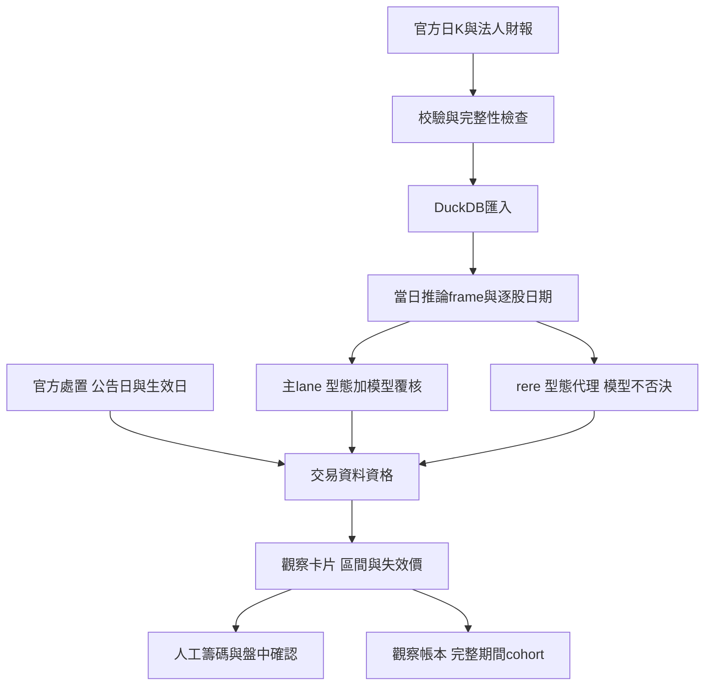

# 台股策略、skill 與介面修復驗證（2026-09-06）

## 結論與策略決定

保留 rere 的蹲點／發動條件、族群優先、小倉與裁量出場方法；主lane技術門檻也保留。
本輪修的是會讓選股資格、績效與畫面失真的缺陷。沒有重訓、切換模型、改Champion pins，
也沒有將型態回測結果冒充 KOL 本人或實盤資金組合績效。

主lane模型附加效果仍需更多真正同日、獨立期間的前瞻證據。現有資料不足以支持提升dataA、
擴大rere倉位或換掉主策略。維持現行主策略不等於已證實其完整投資績效優良。

## 修復邊界



| 缺陷 | 已做修復 | 驗證 |
|---|---|---|
| 健康JSON被誤當處置名單 | 驗雙市場完整期間、hash、新鮮度與交易日覆蓋；未知不放行 | 15筆官方修訂、缺頁/失敗/錯日期fixtures |
| 已公告但T+1才處置漏抓 | 官方查詢延至下一交易日，再按公告截止過濾 | 同截止167→172列，補5筆 |
| 夜間舊模型frame混今日CSV | 校驗→ingest→新shadow frame→候選；保留逐股日期與同frame營益率 | 日期/停牌舊列/缺欄/失敗順序fixtures |
| 校驗回False仍記DONE | 明確False或例外為FAIL，擋ingest/候選 | timeout/False與成功順序測試 |
| 本業營益率未知默許主lane | 改待確認；未知不占有效主名額，也不得間接擋掉rere | main/rere重疊fixture |
| shadow入帳就跳過補分數 | 冪等重建分數檔、歷史分數保留、同日Champion對照 | 重跑不重複、舊分數不刪 |
| rere veto/watch誤入帳、補跑超期停損 | 只記合格觀察、保留型態、最多掃到第60日 | 帳本隔離A/B與邊界fixtures |
| 只用提前結算輸家評策略 | 完整60日觀察機會cohort，早停同梯一起算 | 現存完整cohort=0 |
| 回測公式/均量/成熟期不一致 | 現行rere predicate直接共用；主型態直接呼叫_pattern_ok | 固定輸入歷史重播、單因子比較 |
| 最新成交量篩全部歷史、20日也等60日 | 逐日均量、各期限獨立成熟、因子還原、成本敏感度 | 計分板8個focused tests |
| V2 test控制early stopping | 獨立validation、兩側20日purge、同日月底cohort | 改test標籤不能影響37輪選擇的fixture |
| 卡片誤導或過期證據 | 狀態/區間/失效/尚缺確認優先；舊TDCC不否決、veto不誤顯示小倉 | 桌面及390px手機QA |
| Claude/Codex指引矛盾 | 單一canonical skill、修路徑控制字元、移除全量亂commit指令、Codex發現入口 | 6個wrapper驗證通過 |

## 回測與A/B結果

### 凍結同一資料的選股驗證

- 1,080檔，97,200列 DuckDB原始日K，從既有Web服務的唯讀API各抓一次並凍結。
  DB size/mtime前後未變，沒有停止使用中的服務。
- 同一原始推論frame、同一模型、同一z-score，分數最大絕對差 **0**。
- 主型態與rere predicate AST完全一致；本次固定快照 **18→18檔**，無新增、刪除、kind翻轉。
- `prob_edge`不適用：本路徑使用迴歸分數，沒有該欄位；未捏造機率變化。
- 快照 SHA256 `d5e32d15a4f9621f68176a7f4edd0c19add7c4a234a777d0d8fc5356e0a9fb06`；
  日K frame SHA256 `1341f0db538f88cdc6564d8f8990ed1331de9ac43f3ed5e10b48daa2f2e9096f`。
- 正式名單重建後均使用9/4來源，供9/7觀察。相比之前9/3模型的舊畫面，主lane名單可以不同，
  那是新一天的輸入，不是上述同快照A/B的策略翻轉；rere六檔仍相同。

處置歷史A/B：同一168列DuckDB frame中8檔共24個ticker/date資格翻轉，全部在修訂公告後；
公告前翻轉0。這證明交易資格資料修正，不代表策略報酬上升。

### rere：保留方法，重建可比證據

2020年至2026/9/4，依現行蹲點條件、隔日收盤進、MA60×0.97失效、完整60日機會：

| 樣本 | 成熟訊號 | 平均毛報酬 | 毛勝率 | 平均淨報酬 |
|---|---:|---:|---:|---:|
| 蹲點型 | 9,154 | +3.40% | 34.2% | +2.59% |
| 發動型 | 13 | +28.83% | 53.8% | +27.82% |

淨報酬假設：一般股票賣出稅0.3%、每邊手續費0.1425%、每邊10bps滑價。
發動型樣本過少、右尾集中，不能據這組平均值加碼。蹲點2022、2024年淨均為−4.09%、−1.32%，
並非各種市況都有效。上述不是完整日選top6、主題/分點/盤中成交策略。

正式帳本複本A/B：236筆，135提前停損、88持有、7重複排除、6待進場，結果翻轉0、報酬差0。
完整60日觀察機會cohort為0，因此取消只根據早停勝率11.1%就降權的判斷。正式帳本未被此研究改寫。

### 主策略：目前不改門檻，不升級模型

目前主技術型態、2020起四碼非0股票子組，近期同股票不重疊：

| 期限 | 訊號數 | 淨均值（總成本0.4%） | 勝率 | 中位數 |
|---|---:|---:|---:|---:|
| 20日 | 2,961 | +3.18% | 48.1% | −0.54% |
| 60日 | 959 | +7.06% | 48.8% | −0.44% |

過半樣本未贏，正平均依賴少數大贏家。這只驗技術型態，沒有歷史模型/財報/處置/盤中執行；
不同股票同樣受市場行情影響，不是獨立樣本，也尚無同期間超額報酬證據。
全量主型態2025年20日均值由成本0.4%的+0.23%，變成成本0.8%的−0.17%。

另按模型目標重播dataA/Champion當日Top30（次日開盤→訊號後第20日收盤、公司行動因子）：
24個完整配對日，成本情境淨均 **dataA −0.40%、Champion +2.35%**，差−2.75pp。
但是20日不重疊只剩2批，差值反而+2.86pp；加上舊帳本來源日證據不完整，不能作模型升降級決策。
這不等於兩套正式策略的資金績效。

## 新台股制度的應用

- 8/10處置新制：依證交所對照表15筆修訂，保存8/7 18:00知悉時點與原公告期間；
  例如8046原8/18結束改8/11。採查詢時修訂視圖，不把後來知識回灌公告前歷史。
  來源：[TWSE官方對照表](https://www.twse.com.tw/downloads/zh/about/company/dispositionlist.pdf)。
- 波段研究用一般股票賣出稅0.3%；不誤用延長至2027/12/31的當沖0.15%優惠。
  來源：[財政部修法說明](https://www.mof.gov.tw/singlehtml/384fb3077bb349ea973e7fc6f13b6974?cntId=4493245d64e5422887a375921e889465)。
- TDCC是週持股分級快照，不是分點主力成本；來源過期不能給當日買賣結論。

## 還不能宣稱已完成的能力

- rere的主題判斷、賣壓力／留基本倉／反覆波段、分點與主力成本仍需人工。
  本輪刻意不以簡化回測取代這些裁量，也不改其策略來配合模型。
- 處置契約不涵蓋 attention、full_delivery、suspended 全部來源，輸出保留unsupported標記。
  舊直接讀期間CSV的其他訓練／回測／unified consumers尚未全面切換修訂視圖，不能冒稱全系統都完成PIT。
- 產業強度與MOPS沒有完整歷史公布時點archive，canonical CLI只允許最新已收盤日，歷史研究使用獨立回測器。
- 日K無法驗證盤中15–30分鐘守穩、滑價、漲跌停成交；rere加回權息法對分割/減資亦有限制。
- 未跑新的真實訓練，V2修復只有資訊隔離與執行緒fixture；V1其他訓練路徑仍應另做完整標籤邊界稽核。

## 驗證與重現

包含最後卡片修復與執行緒驗證的整合 suite 為 **166 passed in 2.59s**。
最後 UI 檢查為 18 張卡片、桌面與 390px 手機均正常、瀏覽器錯誤 0。
所有測試禁止寫正式帳本。修復既有測試曾直接呼叫fundamentals `heal=True` 的隔離漏洞後，
1,901個日K、權息日曆與正式rere帳本核對未變；沒有全體財報測前hash，因此不擴張宣稱。

```powershell
python -B -X utf8 -m pytest tests/test_generate_entry_candidates.py tests/test_disposition_contract.py tests/test_rere_lane_tracker_integrity.py tests/test_rere_baseline_integrity.py tests/test_smart_update_auto.py tests/test_strategy_pipeline_integrity.py tests/test_shadow_dataA_contract.py tests/test_shadow_target_evaluation.py tests/test_entry_dashboard_cards.py tests/test_entry_dashboard_freshness.py tests/test_strategy_scoreboard.py tests/test_train_v2_temporal_validation.py tests/test_lgbm_thread_config.py -q
python -B -X utf8 scripts/audit_entry_integrity.py --as-of 2026-09-04 --trade-date 2026-09-07 --output ml/reports/research/strategy_integrity_20260906/entry
python -B -X utf8 scripts/evaluate_shadow_dataA_integrity.py --as-of 2026-09-04 --output ml/reports/research/strategy_integrity_20260906/shadow
```

本地原始凍結檔位於研究entry/frozen（不入Git）；輸入hash、逐筆A/B與聚合回測報告入Git。
其他重現命令與方法鎖：`docs/REPORT_disposition_contract_20260906.md`、
`docs/REPORT_scoreboard_research_20260906.md`、`docs/METHOD_rere_verification_20260906.md`。
UI驗證：`docs/REVIEW_entry_cards_20260906.md`。研究明細與manifest保留於ml/reports。

## 發佈與提交紀錄

正式HTML：`ml/reports/entry_dashboard_latest.html`，9/7計畫的型態與模型來源均為9/4。
固定Artifact `https://claude.ai/code/artifact/8705d1fe-77ce-411e-a162-895c7c8fb22b`
在本session缺少Claude Artifact工具及可用登入瀏覽器，**不能宣稱已原地更新**。
保留原有Claude Desktop 07:45發佈工作；沒有另建Artifact或改排程。

- 已更新既有發佈 repo `F:/kol-watch` 的唯一檔案 `entry_dashboard_latest.html`，
  以 `a49202363da3f2f2edff53c60e0880fe62969205` 推送到原有 `origin/main`，
  `git ls-remote` 已確認相同 SHA，該 repo 工作樹乾淨。
  這是既有 GitHub 發佈檔更新，不代表 Claude Artifact 已同步，也未宣稱啟用了 GitHub Pages。
- 最後正式 HTML 與本機預覽位元組相同，SHA256
  `0d3e7bd4853d480d431e73e21f2e9cb6477aa744faa748b88f756af94cc49732`。
  本機預覽：`http://127.0.0.1:8876/entry_cards_20260906.html`（需本機預覽服務運行）。
- UTF-8 郵件預覽驗證後，於 2026-09-06 02:08:20 發送至既有設定的 1 位收件人。
  郵件清楚標示「固定 Claude Artifact 網址目前尚未同步」，沒有誤報遠端更新。
  回執：`logs/strategy_notice_20260906_receipt.json`；預覽 SHA256
  `b60428e6f8a873505b40aa50f4fbd08ac85ca06bbe5f6501bead92c20d91080d`。
  Artifact 同步後請按 Ctrl+F5。

本輪開始於 `a1849103`，分支 `codex/strategy-integrity-20260906`。完整提交分類：

| Commit | Message | 白名單／變更分類 |
|---|---|---|
| b8a39a52 | fix(strategy): enforce dated candidates and complete forward cohorts | L1/L2/L3：資料與排程修復、交易資料資格、觀察帳本衡量；方法鎖、同快照 A/B、官方原始對帳。含本輪研究證據與9/4同模型推論，沒有模型替換 |
| ca05db95 | fix(research): align pattern backtests with dated inputs and costs | research-only：歷史計分板與報酬量測修復，逐筆研究證據；不改 production 選股門檻 |
| 9b12d26e | fix(training): isolate V2 validation from forward test labels | training infrastructure：未來 V2 訓練評估隔離；本輪只有 fixture，未訓練、未改 protected artifacts |
| d2659bbd | fix(dashboard): clarify dated observation cards and strategy scope | production presentation：卡片易讀性、來源資格與補充判斷；同名單 UI A/B，排序/型態/策略區間不變 |
| 本報告所屬提交 | docs(skills): align shared strategy evidence and review handoff | L0 governance：Claude/Codex 共享 skill、移除矛盾指引、研究結論與本報告 |
| a492023（F:/kol-watch） | fix(dashboard): publish dated strategy observation cards | 既有發佈 repo 的 HTML 更新；不含其他檔案或排程改動 |

F:/stock 開始時已有每日 runtime 與其他任務產物異動，本輪保留它們，因此整體工作樹不乾淨。
所有本輪完成的程式、skill、研究與正式 UI 交付均已分別提交；未將既有帳本、日常新聞、
9/5 V2 meta 或其他不相關產物混入提交。`dataA_predictions_2026-09-02.csv` 的既有刪除亦未提交。
