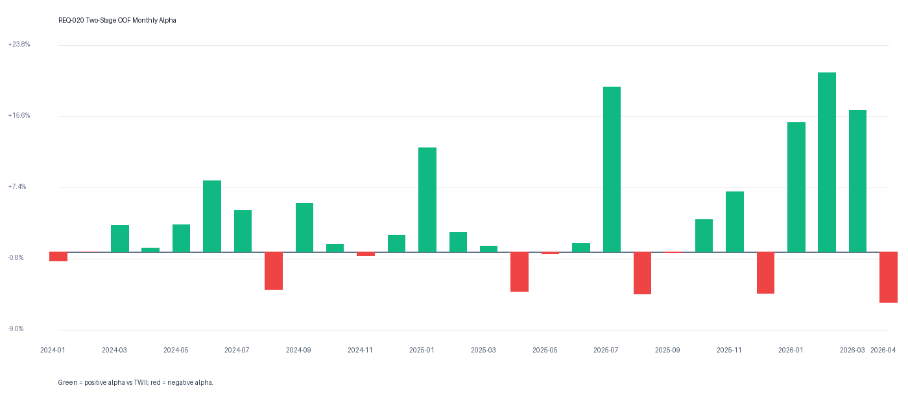

# REQ-020 歷史 OOF 精準率分析報告

- Data source: `F:\stock\ml\reports\audit002_step5_grid_search_20260509_N75_bins5_fold_top30.csv`
- Model: `Two-Stage Champion N=75 / 5-level LambdaRank`
- Window: `2024-01` to `2026-04` (28 months)
- Positions: `840`

## 直接答案

過去 28 個月 walk-forward OOF Top30 中，**58.45% 的倉位 20D 報酬為正**，**49.05% 跑贏同期 TWII**。

## 1. Position-Level 勝率

| 範圍 | 樣本數 | 平均 20D 報酬 | 平均 alpha vs TWII | 正報酬勝率 | 跑贏 TWII 比率 |
| --- | ---: | ---: | ---: | ---: | ---: |
| Top30 all | 840 | +7.64% | +3.54% | 58.45% | 49.05% |

## 2. Rank 準確率

| Rank bucket | 樣本數 | 平均 20D 報酬 | 平均 alpha vs TWII | 正報酬勝率 | 跑贏 TWII 比率 |
| --- | ---: | ---: | ---: | ---: | ---: |
| Rank 1-10 | 280 | +11.28% | +7.18% | 62.86% | 55.71% |
| Rank 11-30 | 560 | +5.81% | +1.71% | 56.25% | 45.71% |

### Rank 10 段分布

| Rank bucket | 樣本數 | 平均 20D 報酬 | 平均 alpha | 勝率 |
| --- | ---: | ---: | ---: | ---: |
| Rank 1-10 | 280 | +11.28% | +7.18% | 62.86% |
| Rank 11-20 | 280 | +5.06% | +0.96% | 55.00% |
| Rank 21-30 | 280 | +6.57% | +2.47% | 57.50% |

## 3. 月份分布

- Alpha 為正月份: `18` / `28`
- Alpha 非正月份: `10` / `28`
- 最好月: `2026-02` alpha `+20.66%`
- 最差月: `2026-04` alpha `-5.84%`

| 月份 | 樣本數 | 平均 20D 報酬 | Alpha | 勝率 | 跑贏 TWII |
| --- | ---: | ---: | ---: | ---: | ---: |
| 2024-01 | 30 | +9.20% | -1.07% | 83.33% | 33.33% |
| 2024-02 | 30 | +6.20% | -0.02% | 60.00% | 46.67% |
| 2024-03 | 30 | +3.57% | +3.07% | 53.33% | 50.00% |
| 2024-04 | 30 | +6.63% | +0.42% | 66.67% | 53.33% |
| 2024-05 | 30 | +12.00% | +3.10% | 80.00% | 43.33% |
| 2024-06 | 30 | +4.69% | +8.20% | 53.33% | 66.67% |
| 2024-07 | 30 | +5.54% | +4.76% | 46.67% | 46.67% |
| 2024-08 | 30 | -4.52% | -4.33% | 26.67% | 26.67% |
| 2024-09 | 30 | +8.06% | +5.56% | 66.67% | 63.33% |
| 2024-10 | 30 | -1.41% | +0.87% | 40.00% | 50.00% |
| 2024-11 | 30 | +4.08% | -0.47% | 50.00% | 36.67% |
| 2024-12 | 30 | +3.87% | +1.95% | 63.33% | 60.00% |
| 2025-01 | 30 | +8.74% | +12.01% | 76.67% | 90.00% |
| 2025-02 | 30 | -4.08% | +2.21% | 20.00% | 50.00% |
| 2025-03 | 30 | -1.55% | +0.68% | 33.33% | 33.33% |
| 2025-04 | 30 | +0.96% | -4.54% | 40.00% | 26.67% |
| 2025-05 | 30 | +5.54% | -0.24% | 53.33% | 23.33% |
| 2025-06 | 30 | +6.15% | +0.96% | 60.00% | 43.33% |
| 2025-07 | 30 | +21.99% | +19.04% | 83.33% | 76.67% |
| 2025-08 | 30 | +0.69% | -4.87% | 43.33% | 16.67% |
| 2025-09 | 30 | +9.21% | -0.13% | 66.67% | 46.67% |
| 2025-10 | 30 | +1.55% | +3.70% | 53.33% | 60.00% |
| 2025-11 | 30 | +11.21% | +6.92% | 63.33% | 46.67% |
| 2025-12 | 30 | +7.50% | -4.83% | 53.33% | 36.67% |
| 2026-01 | 30 | +21.32% | +14.92% | 76.67% | 66.67% |
| 2026-02 | 30 | +14.16% | +20.66% | 60.00% | 70.00% |
| 2026-03 | 30 | +39.06% | +16.36% | 93.33% | 66.67% |
| 2026-04 | 30 | +13.50% | -5.84% | 70.00% | 43.33% |

## 4. 進場技術狀態 × 報酬

| 進場 MA5 group | 樣本數 | 平均 20D 報酬 | 平均 alpha | 正報酬勝率 | 跑贏 TWII |
| --- | ---: | ---: | ---: | ---: | ---: |
| A_price_vs_ma5_at_entry_gt_0 | 441 | +8.41% | +3.37% | 57.82% | 47.85% |
| B_minus5pct_to_0 | 319 | +7.30% | +3.60% | 61.76% | 51.41% |
| C_le_minus5pct | 80 | +4.76% | +4.22% | 48.75% | 46.25% |

## PM Notes

- 這是 walk-forward OOF，不是 in-sample 訓練內評估。
- 報酬欄位使用 fixed OOF artifact 的 `trade_return_20d` / `trade_excess_return_20d`。
- MA5 group 使用 prediction date 後一個交易日 open 相對 signal date MA5，對齊 entry timing。
